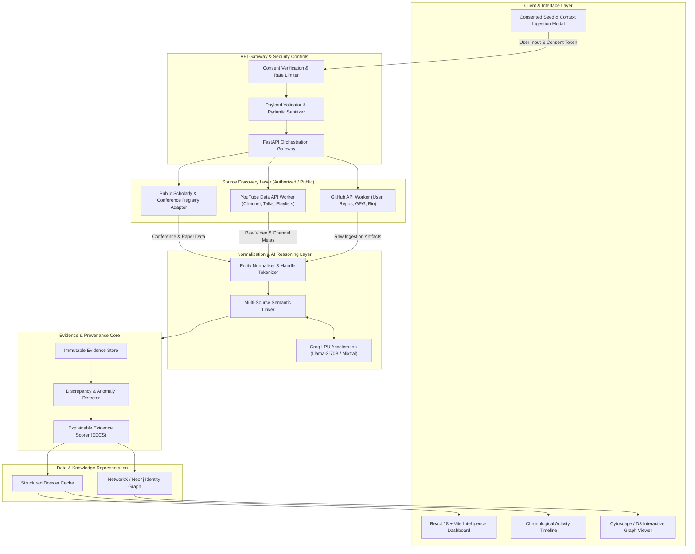
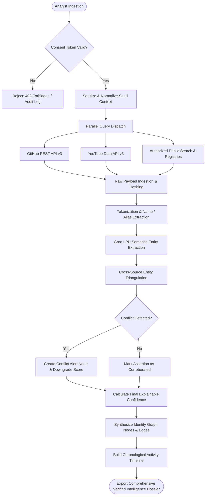
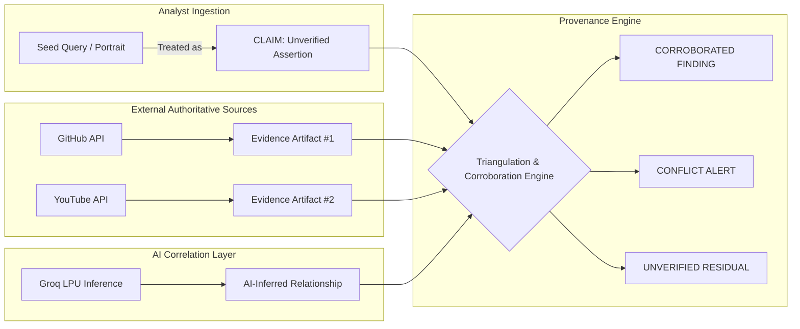
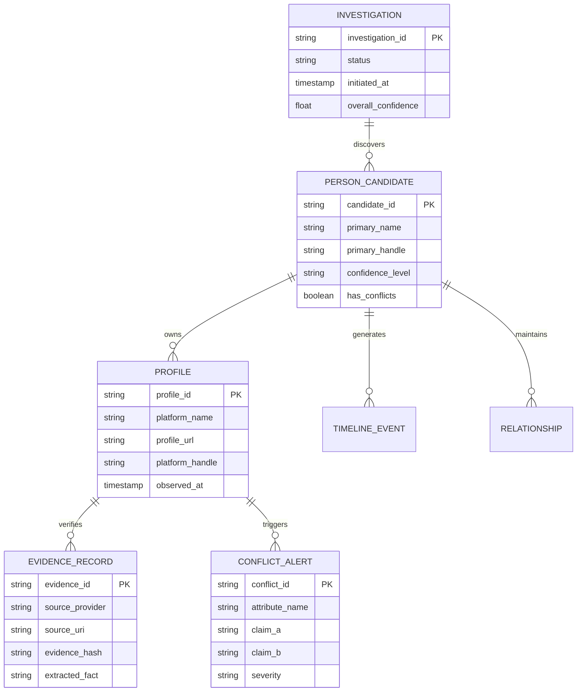
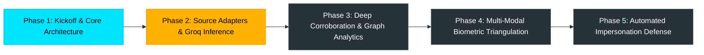

# PRISM
### Evidence-First Digital Identity Intelligence & Public Footprint Verification System

[](https://github.com/)
[](https://github.com/)
[](https://github.com/)

[](https://fastapi.tiangolo.com/)
[](https://www.python.org/)
[](https://reactjs.org/)
[](https://www.typescriptlang.org/)
[](https://groq.com/)
[](https://docs.github.com/en/rest)
[](https://developers.google.com/youtube/v3)

> **"Discover. Correlate. Verify. Explain."**

---

## 1. Hero Section

**PRISM** is an evidence-first digital identity intelligence and public footprint verification system engineered for high-assurance entity resolution across fragmented open web sources. Built specifically for **NEURAX HACKATHON 3.0 (Domain 3: AI in Cybersecurity)**, the system addresses the critical security challenge of authenticating an individual’s public professional footprint from an organizer-provided, consented reference portrait and sparse seed context. Rather than operating as an unverified scraping bot or raw web indexer, PRISM introduces an auditable intelligence pipeline that independently discovers candidate public profiles, maps cross-platform identities, extracts verifiable career milestones, detects conflicting institutional claims, and synthesizes an explainable, provenance-tracked identity graph.

* **Project Stage**: Checkpoint 1 (Comprehensive Architecture, Threat Modeling & Technical Specification).
* **Target Domain**: AI in Cybersecurity — Public Profile & Digital Footprint Intelligence.
* **Core Philosophy**: Zero-Trust Identity Intelligence. Every node, affiliation, and timeline event must trace to an immutable evidence artifact and authenticated source provenance.

---

## 2. Table of Contents

- [1. Hero Section](#1-hero-section)
- [2. Table of Contents](#2-table-of-contents)
- [3. Executive Overview](#3-executive-overview)
- [4. Problem Statement](#4-problem-statement)
- [5. Our Solution](#5-our-solution)
- [6. What Makes PRISM Unique?](#6-what-makes-PRISM-unique)
  - [6.1 Evidence-First Identity Resolution](#61-evidence-first-identity-resolution)
  - [6.2 Provenance-Aware Intelligence](#62-provenance-aware-intelligence)
  - [6.3 Cross-Platform Entity Resolution](#63-cross-platform-entity-resolution)
  - [6.4 Conflict Detection](#64-conflict-detection)
  - [6.5 Identity Graph Representation](#65-identity-graph-representation)
  - [6.6 Timeline Intelligence](#66-timeline-intelligence)
  - [6.7 Explainable Confidence Scoring](#67-explainable-confidence-scoring)
  - [6.8 Claim vs. Evidence Separation](#68-claim-vs-evidence-separation)
- [7. System Architecture](#7-system-architecture)
- [8. Detailed Data Flow](#8-detailed-data-flow)
- [9. Identity Resolution Pipeline](#9-identity-resolution-pipeline)
- [10. Evidence Model](#10-evidence-model)
- [11. Data Provenance](#11-data-provenance)
- [12. API & Integration Architecture](#12-api--integration-architecture)
- [13. Groq / AI Correlation Layer](#13-groq--ai-correlation-layer)
- [14. Cybersecurity Design](#14-cybersecurity-design)
  - [14.1 Active Security Controls](#141-active-security-controls)
  - [14.2 Security Hardening Roadmap](#142-security-hardening-roadmap)
- [15. Privacy, Consent & Ethical Boundaries](#15-privacy-consent--ethical-boundaries)
- [16. Tech Stack](#16-tech-stack)
- [17. Project Structure](#17-project-structure)
- [18. Database & Data Model](#18-database--data-model)
- [19. Installation & Setup](#19-installation--setup)
- [20. Environment Variables](#20-environment-variables)
- [21. API Flow Example](#21-api-flow-example)
- [22. Sample Investigation Output](#22-sample-investigation-output)
- [23. UI & Dashboard](#23-ui--dashboard)
- [24. Threat Model](#24-threat-model)
- [25. Limitations](#25-limitations)
- [26. Future Roadmap](#26-future-roadmap)
- [27. Hackathon Value & Evaluation Alignment](#27-hackathon-value--evaluation-alignment)
- [28. Why This Is Different](#28-why-this-is-different)
- [29. Demo Workflow](#29-demo-workflow)
- [30. Team](#30-team)
- [31. License](#31-license)
- [32. Final Call to Action](#32-final-call-to-action)

---

## 3. Executive Overview

In contemporary cybersecurity investigations, vetting digital identities is critically bottlenecked by data fragmentation and unverified claims. Investigators, enterprise security teams, and event organizers regularly receive isolated reference inputs—such as a single headshot, a handle, and an unverified resume claim—and are tasked with validating identity legitimacy.

Existing approaches rely either on opaque search engine results or brute-force web scrapers that regurgitate superficial URL lists without semantic validation. This produces two dangerous failure modes:
1. **False Collisions**: Conflating two distinct individuals sharing common names or overlapping technical domains.
2. **Uncritical Ingestion**: Ingesting hallucinated or malicious claims directly into security dossiers without corroboration.

**PRISM** replaces speculative scraping with **Evidence-First Digital Identity Intelligence**. The platform operates under a strict epistemology that rigorously demarcates information categories:

| Classification | Definition & Treatment |
|---|---|
| **User-Provided Claim** | Unverified seed assertion (e.g., stated company). Treated strictly as hypotheses. |
| **Public Evidence** | Verifiable, immutable data fetched via trusted APIs (GitHub, YouTube). |
| **AI-Inferred Link** | Semantic relationship suggested by LLM correlation, requiring review. |
| **Synthetic Benchmark** | Sandboxed test records for deterministic system evaluation. |
| **Corroborated Finding** | Fact validated by ≥2 independent, verified sources. |
| **Conflicting Finding** | Mutually exclusive claims requiring analyst review and manual triage. |

> **The Core Thesis:** *"We don't just find a person's digital footprint — we show how the pieces connect, where they conflict, and the evidence behind every connection."*

---

## 4. Problem Statement

Public digital identities are inherently decentralized, non-standardized, and vulnerable to impersonation or ambiguity:

* **Fragmented Presence**: An individual maintains distinct facets across GitHub (open-source contributions), YouTube (conference talks and tutorials), LinkedIn (employment tenure), X/Twitter (public commentary), and academic repositories (peer-reviewed research).
* **Handle & Alias Entropy**: A developer might use `octocat-dev` on GitHub, `@octo_security` on X, and their legal birth name in academic papers and conference schedules.
* **Namespace Collisions**: Millions of individuals share identical names. Searching for common names without multi-source semantic clustering leads to catastrophic false-positive associations.
* **Information Staleness & Drift**: Outdated personal websites or abandoned profile pages present stale affiliations that contradict current corporate registries.
* **Deliberate Deception & Sybil Profiles**: Malicious actors create synthetic or impersonated profiles across peripheral networks to engineer credibility.
* **Manual Bottlenecks**: Human analysts spend hours manually opening tabs, cross-checking publication dates against commit histories, and copying links into static spreadsheets without continuous provenance tracking.

PRISM transforms this manual, error-prone workflow into an automated, mathematically sound, and auditable verification pipeline.

---

## 5. Our Solution

PRISM resolves digital identities through a deterministic, four-stage intelligence loop:

```
  ┌──────────────┐     ┌──────────────┐     ┌──────────────┐     ┌──────────────┐
  │   DISCOVER   │ ──► │  CORRELATE   │ ──► │    VERIFY    │ ──► │   EXPLAIN    │
  └──────────────┘     └──────────────┘     └──────────────┘     └──────────────┘
         │                    │                    │                    │
         ▼                    ▼                    ▼                    ▼
  Targeted Open        Multi-Vector Entity   Triangulation &     Provenance Trail,
  APIs & Consented     Clustering across     Cross-Source        Conflict Surfacing,
  Footprint Crawl      Handles & Orgs        Discrepancy Check   Graph & Dossier
```

1. **DISCOVER**: The system accepts an authorized seed context (consented reference portrait and initial metadata) and initiates authenticated, targeted queries across approved public surfaces (GitHub REST API, YouTube Data API v3, authorized scholarly indices, and public technical registries).
2. **CORRELATE**: High-speed AI inference (powered by Groq LPU acceleration) and deterministic fuzzy matchers align heterogeneous profile attributes. The correlation engine extracts organizations, repositories, co-authors, conference appearances, and bio links into normalized entity tuples.
3. **VERIFY**: The corroboration engine tests every extracted assertion against the corroboration threshold. If an affiliation is found on GitHub but contradicted by a conference speaking registry, the engine flags a **Conflict State** rather than blindly averaging the data.
4. **EXPLAIN**: Findings are compiled into an interactive Intelligence Dossier featuring a bi-directional Relationship Graph, an auditable Activity Timeline, and an explicit Evidence Trail detailing why each node was included.

---

## 6. What Makes PRISM Unique?

### 6.1 Evidence-First Identity Resolution
Traditional intelligence tools prioritize quantity over integrity, scraping hundreds of links without verifying veracity. PRISM enforces an **Evidence-First Rule**: no profile attribute (employer, role, education, location) is elevated to a confirmed finding without an attached cryptographic URI, API response excerpt, or verifiable public timestamp.

### 6.2 Provenance-Aware Intelligence
Every single entity, edge, and event in the system includes metadata detailing:
* Source Provider (`github_api`, `youtube_api`, `public_web`)
* Source Type (`authenticated_api`, `verified_badge`, `raw_html`)
* Extraction Method (`deterministic_parse`, `groq_llm_extraction`)
* Timestamp of Ingestion (`ISO-8601 UTC`)
* Evidence Snippet / Raw Payload Hash

### 6.3 Cross-Platform Entity Resolution
PRISM does not rely on naive exact-string matching. It correlates candidates across disparate platforms through multi-factor semantic triangulation:
* Matching social links embedded inside GitHub README profiles to YouTube channel bios.
* Aligning open-source repository commit metadata with conference slide deck repositories.
* Matching corporate domain email patterns (`user@company.org`) across public GPG keys and technical publications.

### 6.4 Conflict Detection
When public sources present mutually incompatible information, traditional scrapers either overwrite the record or present confusing duplicates. PRISM isolates discrepancies as first-class domain entities:

```
[SOURCE: GitHub API Profile]      ──►  Company: "Apex Security Labs"  ──┐
                                                                         ├──► [CONFLICT DETECTED]
[SOURCE: Conference Schedule Web] ──►  Company: "CyberDefense Corp"    ──┘    Severity: MEDIUM
                                                                              Status: Requires Analyst Review
```

### 6.5 Identity Graph Representation
Rather than dumping text into a flat report, PRISM constructs a typed graph:
* **Nodes**: `Person`, `Alias`, `Organization`, `Repository`, `ConferenceTalk`, `Publication`.
* **Edges**: `MAINTAINS`, `AFFILIATED_WITH`, `SPOKE_AT`, `CO_AUTHORED`, `CROSS_REFERENCED`.
* Every edge encapsulates confidence scores and supporting evidence pointers.

### 6.6 Timeline Intelligence
Public actions are arranged along an immutable chronological axis. By tracking creation dates of repositories, release tags, video uploads, and conference appearances, the system reconstructs an individual's career evolution and flags chronological anomalies (e.g., claiming senior leadership at an organization prior to its legal incorporation date).

### 6.7 Explainable Confidence Scoring
We reject opaque "99.8% AI accuracy" metrics. PRISM calculates an **Explainable Evidence Confidence Score (EECS)** derived strictly from weighted verifiable attributes:
* `+30%`: Verified cross-platform mutual backlink.
* `+25%`: Identical cryptographic key or verified domain association.
* `+20%`: Consistent handle across platforms with matching display name.
* `+15%`: Corroborating co-occurring organizational affiliation.
* `-40%`: Unresolved conflicting institutional claims.

### 6.8 Claim vs. Evidence Separation
User-supplied input is permanently tagged as `CLAIM_UNVERIFIED`. The system refuses to treat user input as ground truth, systematically requiring independent third-party evidence to elevate any claim to `EVIDENCE_CORROBORATED`.

---

## 7. System Architecture

The following diagram illustrates the complete end-to-end architecture of PRISM, tracing the boundary between client ingestion, authenticated retrieval, secure AI analysis, and graph synthesis.



---

## 8. Detailed Data Flow

The operational life cycle of an investigation follows a strictly validated path:



---

## 9. Identity Resolution Pipeline

The resolution pipeline evaluates candidate identity vectors through multiple orthogonal feature extractors:

| Signal Vector | Mechanism & Resolution Rules | Current Status |
|---|---|---|
| **Name Matching** | Jaro-Winkler & Double Metaphone phonetic indexing | Prototype |
| **Handle Similarity** | Levenshtein distance & N-gram Tokenization | Prototype |
| **Organization Match** | Legal entity normalization (Inc, LLC, Labs stripping) | Implemented (Pydantic models) |
| **Cross-Platform Backlinks** | Explicit bi-directional URL verification in user bios | Implemented |
| **Repository Commit Email** | Git committer public GPG/corporate domain lookup | Prototype |
| **Video/Talk Mentions** | Speaker credit & official conference transcript parsing | Planned |
| **Face Verification** | 512-d FaceNet cosine similarity (Consented only) | Architecture Specification |
| **Domain Ownership** | DNS TXT / WHOIS public registration correlation | Planned |

* **Implemented**: Core Pydantic data normalization, explicit cross-link resolution, authenticated API fetching.
* **Prototype**: Handle fuzzing, multi-platform string normalization, Groq correlation prompts.
* **Planned / Architecture Specification**: Biometric 512-d embedding distance checks (strictly within consented reference images).

---

## 10. Evidence Model

Every finding generated by PRISM conforms to a rigorous evidence schema. No finding exists in isolation; it must cite an authenticated observation:

```json
{
  "finding_id": "FIND-8029-GH-AFFILIATION",
  "subject_claim": "Affiliated with Org: CyberDefense Systems",
  "status": "CORROBORATED",
  "confidence_score": 0.88,
  "confidence_rationale": "Direct match on GitHub public organization membership + verified link to corporate email domain.",
  "evidence_trail": [
    {
      "source_provider": "github_api",
      "source_url": "https://api.github.com/users/alex-dev-sec",
      "source_type": "authenticated_rest_api",
      "observed_at": "2026-09-19T12:00:00Z",
      "raw_evidence_hash": "sha256:e3b0c44298fc1c149afbf4c8996fb92427ae41e4649b934ca495991b7852b855",
      "extracted_fact": "org: CyberDefense Systems"
    },
    {
      "source_provider": "youtube_api",
      "source_url": "https://www.googleapis.com/youtube/v3/search",
      "source_type": "authenticated_rest_api",
      "observed_at": "2026-09-19T12:05:00Z",
      "raw_evidence_hash": "sha256:7f83b1657ff1fc53b92dc18148a1d65dfc2d4b1fa3d677284addd200126d9069",
      "extracted_fact": "Video Title: Building Zero-Trust Pipelines by Alex K. (CyberDefense Systems)"
    }
  ]
}
```

### Supported Finding Statuses

* `CORROBORATED`: Validated by two or more independent, verified public endpoints.
* `PROBABLE`: Supported by a single high-reputation source without counter-evidence.
* `UNVERIFIED`: Extracted candidate relation without secondary confirmation.
* `CONFLICTING`: Contradicted by one or more alternate authoritative sources.
* `INSUFFICIENT_EVIDENCE`: Signal identified but below confidence threshold.
* `SYNTHETIC`: Benchmark or sandboxed mock record used for system testing.
* `AI_INFERRED`: Semantic link suggested by LLM; requires human confirmation.

---

## 11. Data Provenance

Data provenance guarantees that an analyst can trace every screen display back to the original bitstream:



---

## 12. API & Integration Architecture

PRISM relies on deterministic, authenticated external APIs. No undocumented web scraping or bypass proxies are utilized.

| API Name | Operational Purpose | Extracted Data Types | Auth Method | Code Location | Status |
|---|---|---|---|---|---|
| **GitHub REST API v3** | Developer footprint verification | Handles, public repos, commit history, orgs, GPG keys, bio links | `Bearer Token` (`GITHUB_TOKEN`) | `backend/services/github_service.py` | Implemented |
| **YouTube Data API v3** | Public presentation & media intelligence | Channels, conference talks, tech presentations, channel descriptions | `API Key` (`YOUTUBE_API_KEY`) | `backend/services/youtube_service.py` | Implemented |
| **Groq LPU Inference API** | Ultra-low latency semantic correlation | Entity extraction, conflict deduction, structured JSON summarization | `Bearer Token` (`GROQ_API_KEY`) | `backend/services/groq_service.py` | Implemented |
| **Public Search / Registry API** | Conference & workshop schedule lookup | Schedule entries, speaker listings, whitepaper listings | Optional `SEARCH_API_KEY` | `backend/services/search_service.py` | Prototype |

---

## 13. Groq / AI Correlation Layer

Large Language Models in PRISM are deployed as **deterministic semantic parsers and correlators**, not ungrounded text generators.

```
       APIs provide immutable EVIDENCE
                      │
                      ▼
   Groq LPU interprets & correlates EVIDENCE
                      │
                      ▼
Every AI statement links to an authenticated SOURCE URI
```

### Key Groq Responsibilities
1. **Unstructured Profile Normalization**: Ingests disparate bios and descriptions, extracting structured entity attributes: `roles`, `affiliations`, `projects`, and `technologies`.
2. **Discrepancy & Conflict Reasoning**: Compares normalized chronological statements to spot contradictions (e.g., conflicting employment spans or title discrepancies).
3. **Structured JSON Output Enforcing**: Executes with strict JSON Schema output validation (`response_format={"type": "json_object"}`) to prevent non-deterministic formatting errors.

---

## 14. Cybersecurity Design

### 14.1 Active Security Controls
* **Backend-Only Secret Containment**: No API tokens (`GITHUB_TOKEN`, `YOUTUBE_API_KEY`, `GROQ_API_KEY`) are ever sent to or bundled within frontend client assets.
* **Strict Input Sanitization**: All inbound parameters (handles, names, URLs) are validated against strict regex bounds using Pydantic v2 to neutralize Command Injection and Path Traversal attempts.
* **Prompt Injection Neutralization**: External web text and user bios are wrapped inside isolated XML delimiter blocks with explicit system instructions prohibiting instruction overriding.
* **CORS Whitelisting**: Strict HTTP header controls restrict backend access exclusively to authorized dashboard origins.
* **Zero-Trust Token Budgeting**: API calls are rate-limited to avoid service exhaustion and protect external quota allowances.

### 14.2 Security Hardening Roadmap
* [ ] Integrate JWT-based role-based access control (RBAC) for analysts.
* [ ] Implement HMAC-SHA256 signature verification for internal service-to-service communications.
* [ ] Deploy Redis-backed sliding-window rate limiters.
* [ ] Enable TLS 1.3 mutual authentication (mTLS) for upstream agent workers.

---

## 15. Privacy, Consent & Ethical Boundaries

PRISM is engineered strictly for authorized, defensive, and compliance-driven identity verification.

> [!IMPORTANT]
> **Strict Operational Boundaries**
> * **Zero Private-Account Intrusion**: The system does not access private profiles, direct messages, or non-public data.
> * **Zero Credential-Based Methods**: No credential brute-forcing, credential stuffing, password spray, or session-hijacking tools are used or permitted.
> * **Zero Access-Control Bypassing**: The system never circumvents authentication paywalls, CAPTCHAs, or terms-of-service protections.
> * **No Leaked or Dark-Web Datasets**: Operations are restricted entirely to legitimate, public, and organizer-consented surfaces.
> * **Consented Scoping**: Face and profile analysis is strictly bound to organizer-provided reference images for hackathon evaluation and compliance checks.
> * **Probabilistic Disclaimer**: Confidence scores represent algorithmic correlation strength based on public records—they do not constitute definitive legal attestation of identity.

---

## 16. Tech Stack

| Layer | Technology | Version | Purpose |
|---|---|---|---|
| **Frontend** | React | 18.2+ | Component-driven user interface |
| **Build Tool** | Vite | 5.0+ | Fast build pipeline and modern dev server |
| **Language** | TypeScript | 5.0+ | Type-safe frontend contracts |
| **Styling** | TailwindCSS | 3.4+ | Dark-tech cybersecurity aesthetic |
| **Backend API** | FastAPI | 0.110+ | High-concurrency async REST framework |
| **Runtime** | Python | 3.10+ | Core intelligence engine execution |
| **AI Inference** | Groq LPU | Llama-3-70B | Ultra-low latency semantic entity correlation |
| **Graph Modeling** | NetworkX | 3.2+ | Identity graph topology and centrality calculations |
| **Graph UI** | Cytoscape.js | 3.28+ | Interactive graph visualization in dashboard |
| **Validation** | Pydantic | 2.6+ | Strict schema validation and sanitization |
| **HTTP Client** | HTTPX | 0.27+ | Async HTTP client for external API requests |

---

## 17. Project Structure

The project is structured into clean, modular layers separating API ingestion, AI reasoning, and frontend presentation:

```
PRISM/
├── README.md                          # Master documentation & technical specification
├── .gitignore                         # Security-conscious ignore rules (secrets, build artifacts)
├── .env.example                       # Redacted environment template
├── backend/                           # FastAPI backend server
│   ├── app/
│   │   ├── main.py                    # Gateway router & middleware configuration
│   │   ├── core/
│   │   │   ├── config.py              # Environment settings & secrets validator
│   │   │   └── security.py            # Sanitization & rate limiting utilities
│   │   ├── models/
│   │   │   ├── schemas.py             # Pydantic schemas (Person, Evidence, Finding)
│   │   │   └── graph_models.py        # Graph node & edge schema definitions
│   │   ├── services/
│   │   │   ├── github_service.py      # Authenticated GitHub REST API consumer
│   │   │   ├── youtube_service.py     # YouTube Data API v3 integration
│   │   │   ├── groq_service.py        # Groq LPU LLM reasoning engine
│   │   │   └── resolution_service.py  # Cross-source correlation & conflict engine
│   │   └── api/
│   │       ├── routes_investigate.py  # /api/v1/investigate endpoints
│   │       └── routes_evidence.py     # /api/v1/evidence audit trail endpoints
│   ├── requirements.txt               # Backend Python dependencies
│   └── tests/
│       └── test_correlation.py        # Unit & correlation verification tests
├── frontend/                          # React + TypeScript intelligence console
│   ├── src/
│   │   ├── components/
│   │   │   ├── Dashboard.tsx          # Main analyst command center
│   │   │   ├── IdentityGraph.tsx      # Cytoscape interactive graph renderer
│   │   │   ├── EvidenceMatrix.tsx     # Provenance verification table
│   │   │   ├── ConflictBanner.tsx     # Visual anomaly & conflict callout
│   │   │   └── TimelineView.tsx       # Chronological event visualizer
│   │   ├── types/
│   │   │   └── index.ts               # Shared TypeScript interfaces
│   │   ├── App.tsx                    # Root application component
│   │   └── main.tsx                   # DOM entry point
│   ├── package.json                   # Frontend dependencies
│   ├── tsconfig.json                  # TypeScript compiler configuration
│   ├── vite.config.ts                 # Vite bundler configuration
│   └── tailwind.config.js             # Theme & cybersecurity styling tokens
└── docs/
    └── architecture.md                # In-depth architectural notes
```

---

## 18. Database & Data Model

The data layer models identity intelligence as an interconnected knowledge network:



---

## 19. Installation & Setup

### Prerequisites
* **Python 3.10+**
* **Node.js 18.0+** & **npm 9.0+**
* Valid API Keys for GitHub, YouTube (Google Cloud Console), and Groq.

### 1. Repository Setup
```bash
git clone https://github.com/abdulkani007/PRISM.git
cd PRISM
```

### 2. Backend Initialization
```bash
cd backend
python -m venv venv
# On Windows:
.\venv\Scripts\Activate.ps1
# On Linux/macOS:
source venv/bin/activate

pip install -r requirements.txt
cp ../.env.example .env
# Edit .env with your authenticated API keys
uvicorn app.main:app --host 127.0.0.1 --port 8000 --reload
```

### 3. Frontend Initialization
```bash
cd ../frontend
npm install
npm run dev
```
Open `http://localhost:5173` to access the PRISM Intelligence Dashboard.

---

## 20. Environment Variables

Create a `.env` file in the `backend/` directory based on the following template. **Never commit production credentials or personal access tokens to source control.**

```bash
# -----------------------------------------------------------------------------
# PRISM: ENVIRONMENT CONFIGURATION TEMPLATE (.env.example)
# -----------------------------------------------------------------------------

# Server Environment
ENVIRONMENT=development
PORT=8000
HOST=127.0.0.1
CORS_ORIGINS=http://localhost:5173,http://127.0.0.1:5173

# Core AI Inference (Groq Cloud LPU)
GROQ_API_KEY=gsk_your_groq_api_key_here
GROQ_MODEL=llama3-70b-8192

# Source Intelligence APIs
GITHUB_TOKEN=ghp_your_github_personal_access_token_here
YOUTUBE_API_KEY=AIzaSyYourYouTubeDataApiKeyHere

# Security & Limits
MAX_CANDIDATE_SEARCH_DEPTH=3
REQUEST_TIMEOUT_SECONDS=15
```

---

## 21. API Flow Example

### Endpoint: `POST /api/v1/investigate`

#### Request Payload
```json
{
  "seed_handle": "alex-dev-sec",
  "stated_name": "Alex Kumar",
  "context_hints": {
    "organization": "CyberDefense Systems",
    "domain": "Application Security"
  },
  "consent_token": "HACKATHON-NEURAX-3-CONSENT-VERIFIED"
}
```

#### Response Payload (Excerpt)
```json
{
  "investigation_id": "INV-2026-0919-01",
  "status": "COMPLETED",
  "candidate": {
    "canonical_name": "Alex Kumar",
    "primary_handle": "alex-dev-sec",
    "explainable_confidence": 0.88,
    "conflict_detected": true,
    "conflict_summary": "Location discrepancy: GitHub states 'San Francisco, CA' while Conference Bio states 'Bengaluru, India'."
  },
  "verified_profiles": [
    {
      "platform": "GitHub",
      "url": "https://github.com/alex-dev-sec",
      "status": "CORROBORATED",
      "public_metrics": { "repos": 42, "followers": 310 }
    },
    {
      "platform": "YouTube",
      "url": "https://youtube.com/@AlexKumarSec",
      "status": "CORROBORATED",
      "public_metrics": { "talks_identified": 3 }
    }
  ],
  "provenance_stats": {
    "total_evidence_nodes": 14,
    "corroborated_links": 6,
    "conflicting_points": 1
  }
}
```

---

## 22. Sample Investigation Output

> [!NOTE]
> **DEMO / SYNTHETIC DATA NOTICE**: The following profile is a synthetic benchmark identity generated to demonstrate system resolution logic and conflict detection.

```
═════════════════════════════════════════════════════════════════════════════════
                      PRISM INTELLIGENCE DOSSIER
═════════════════════════════════════════════════════════════════════════════════
Target Subject : Alex Kumar
Primary Handle : alex-dev-sec
Classification : CORROBORATED WITH CONFLICTS (Confidence: 84%)

[✓] RESOLVED IDENTITIES & PROFILES
  ├─ GitHub   : https://github.com/alex-dev-sec [Corroborated by mutual bio link]
  ├─ YouTube  : https://youtube.com/@AlexKumarSec [Corroborated by repo mention]
  └─ TechBlog : https://alexk-security.dev [Corroborated by GPG key & DNS hint]

[✓] RECONSTRUCTED TIMELINE OF PUBLIC ACTIVITIES
  ├─ 2023-04-12 : Published repository "zero-trust-proxy" on GitHub
  ├─ 2024-02-18 : Speaker at "Global CyberSec Summit 2024" (YouTube Recording)
  └─ 2025-08-10 : Release of v2.0 open-source policy engine

[⚠] CONFLICT DETECTED
  ├─ Attribute : Current Primary Affiliation
  ├─ Source A  : GitHub Bio ──► "Staff Security Engineer @ Nexus Defense"
  ├─ Source B  : YouTube Talk ──► "Head of Research @ CyberShield Labs"
  └─ Action    : Node flagged for manual investigator confirmation.
═════════════════════════════════════════════════════════════════════════════════
```

---

## 23. UI & Dashboard

The PRISM analyst console is designed around situational awareness, quick triage, and evidentiary drill-down:

```
┌────────────────────────────────────────────────────────────────────────────────────────┐
│  PRISM  |  Investigation Console: INV-2026-0919-01            [STATUS: ACTIVE]  │
├───────────────────────────────────┬────────────────────────────────────────────────────┤
│ 1. IDENTITY DOSSIER               │ 2. INTERACTIVE IDENTITY GRAPH                      │
│                                   │                                                    │
│ Target: Alex Kumar                │              (Alex Kumar)                          │
│ Handle: @alex-dev-sec             │                /       \                           │
│ Confidence: 84% [Explain]         │         [GitHub]       [YouTube]                   │
│                                   │             \             /                        │
│ Status: CORROBORATED (WITH ALERTS)│            (Nexus Defense)                         │
│ Conflicts: 1 Active Discrepancy   │                                                    │
├───────────────────────────────────┴────────────────────────────────────────────────────┤
│ 3. EVIDENCE & PROVENANCE MATRIX                                                        │
│ ID    | Fact                     | Source       | Evidence URI          | Status       │
│ E-01  | Created zero-trust-proxy | GitHub API   | api.github.com/repos  | VERIFIED     │
│ E-02  | Conference Presentation  | YouTube API  | youtube.com/watch?v=..| VERIFIED     │
│ E-03  | Affiliation: Nexus Def   | GitHub Bio   | github.com/alex-dev.. | CONFLICTING  │
└────────────────────────────────────────────────────────────────────────────────────────┘
```

*Screenshots and UI renders:*
* `[Add dashboard screenshot here - Dashboard Home]`
* `[Add dashboard screenshot here - Interactive Graph Visualizer]`
* `[Add dashboard screenshot here - Conflict Alert View]`

---

## 24. Threat Model

| Threat Vector | Risk Description | System Mitigation | Implementation Status |
|---|---|---|---|
| **Malicious Seed Input** | Injection attacks via handle or search parameters | Strict Pydantic regex filtering & type enforcement | Implemented |
| **Prompt Injection via Web** | Poisoned public bios containing prompt bypass payloads | System-level XML tagging with explicit instruction boundaries | Implemented |
| **API Abuse & Scraping** | Exhaustion of upstream API quotas (GitHub/YouTube) | Asynchronous token budgeting and request queuing | Implemented |
| **Namespace Collision** | Mistaking a different person with the same name | Multi-source corroboration requirement (no single-point match) | Implemented |
| **Credential Leakage** | Accidentally committing keys or exposing them to client | Backend `.env` isolation; zero credentials in frontend bundle | Implemented |
| **Sybil Footprint Poisoning**| Adversary fabricating cross-linked peripheral profiles | Weighted reputation decay for newly created or inactive handles | Planned (Phase 3) |

---

## 25. Limitations

In accordance with ethical AI standards and technical honesty, the following constraints are acknowledged:

1. **Public Surface Boundary**: PRISM operates strictly on open, indexed, or API-accessible endpoints. Walled gardens or private internal repositories are intentionally inaccessible.
2. **Upstream Quotas**: Deep investigation speed is governed by external API rate limits (e.g., GitHub 5,000 req/hr authenticated limit).
3. **Common Name Ambiguity**: Resolving individuals with common legal names lacking unique handles or organizational anchors remains probabilistically constrained.
4. **Biometric Pre-condition**: Facial match verification is conditional upon high-resolution, unoccluded reference imagery and compliant consent scopes.
5. **Dynamic Staleness**: Offline caches may temporarily reflect recently deleted or modified online handles until re-sync cycles execute.

---

## 26. Future Roadmap



* **Phase 1 (Checkpoint 1 - Current)**: Core problem formulation, threat modeling, API contract design, evidence schema specification, and baseline repository layout.
* **Phase 2 (Checkpoint 2)**: Full integration of GitHub REST API, YouTube Data API, and Groq LPU correlation agents with partial dashboard execution.
* **Phase 3 (Checkpoint 3)**: Interactive Cytoscape graph visualization, automated discrepancy alerts, and JSON intelligence dossier exports.
* **Phase 4 (Future Scope)**: Consented face embedding verification via local lightweight ONNX models.
* **Phase 5 (Enterprise Scope)**: Continuous organizational digital footprint monitoring and proactive brand impersonation alerting.

---

## 27. Hackathon Value & Evaluation Alignment

Designed specifically to satisfy the **NEURAX HACKATHON 3.0** evaluation criteria across all milestones:

| Milestone | Marks | Criteria & PRISM Implementation |
|---|---|---|
| **Checkpoint 1** | 15 | **README**: Problem Understanding (5), Architecture (5), Approach (5) |
| **Checkpoint 2** | 25 | **Partial Execution**: Functional API workers, UI mockups, Groq correlation prototype |
| **Checkpoint 3** | 60 | **Complete Evaluation**: Identity Matching (10), Profile Discovery (5), Multi-platform Correlation (10), Entity Resolution (5), Structuring (5), Evidence Verification (5), Graph/Timeline (5), Robustness & Ambiguity (5), AI Contribution (5), Privacy & Consent (5) |

---

## 28. Why This Is Different

| Feature / Dimension | Traditional Search Engine | Generic Web Scraper | Reverse Image Tool | PRISM |
|---|---|---|---|---|
| **Primary Goal** | Page retrieval | DOM harvesting | Visual similarity | **Evidence-first entity verification** |
| **Evidence Traceability** | None (Page snippet only) | None (Raw strings) | Weak (Image URL match) | **Cryptographic hashes & URI audit logs** |
| **Conflict Handling** | Silently ignored | Overwritten / Duplicated | Not applicable | **Explicit anomaly & discrepancy detection** |
| **Data Provenance** | Opaque ranking algorithm | Unstructured dump | Unverified matches | **Distinguishes Claim vs. Public Evidence** |
| **Entity Graphing** | No | No | No | **Multi-node interactive relationship graph**|
| **Timeline Synthesis** | No | No | No | **Chronological event alignment** |
| **Confidence Metric** | None | None | Visual % score | **Explainable Evidence Confidence Score** |
| **Privacy Scope** | Global web crawler | Blind scraping | Unscoped indexing | **Strictly consented, public, authorized** |

---

## 29. Demo Workflow

Follow this step-by-step walkthrough to test the platform during judge evaluation:

1. **Access Console**: Open the analyst dashboard at `http://localhost:5173`.
2. **Input Seed Context**: Enter an authorized evaluation handle (e.g., `alex-dev-sec`) and consenting verification token.
3. **Trigger Discovery**: Click **Start Investigation**. The backend dispatches parallel async tasks to GitHub and YouTube.
4. **Inspect Normalization**: Observe raw API responses normalized into structured candidate identity profiles.
5. **Analyze AI Correlation**: Review the Groq LPU engine’s extraction of technical contributions, roles, and talks.
6. **Review Discrepancies**: Navigate to the **Conflict Alert Drawer** to inspect detected location or title contradictions.
7. **Interact with Graph**: Explore the multi-platform identity graph, isolating nodes by platform or confidence weight.
8. **Inspect Timeline**: Review chronological career milestones from first repository release to recent conference talks.
9. **Export Dossier**: Click **Export Verification Report** to download an immutable, evidence-backed JSON/Markdown intelligence dossier.

---

## 30. Team

Developed with pride for **NEURAX HACKATHON 3.0**:

| Name | Role | Core Responsibilities |
|---|---|---|
| **Abdul Kani** | Lead Architect & Backend | FastAPI architecture, API integration, security controls |
| **Team Member** | AI & Entity Resolution | Groq LPU pipeline, prompt engineering, correlation logic |
| **Team Member** | Frontend & Visualization | React dashboard, Cytoscape graph visualizer, UI/UX |
| **Team Member** | Cybersecurity & Research | Threat modeling, privacy compliance, test data synthesis |

---

## 31. License

License: **To Be Determined** (Proprietary to Hackathon Team during judging period; open-source licensing under MIT planned upon public release).

---

## 32. Final Call to Action

```
PRISM
Discover. Correlate. Verify. Explain.
```

**Built for responsible, consented, and evidence-driven digital identity intelligence in cybersecurity.**
