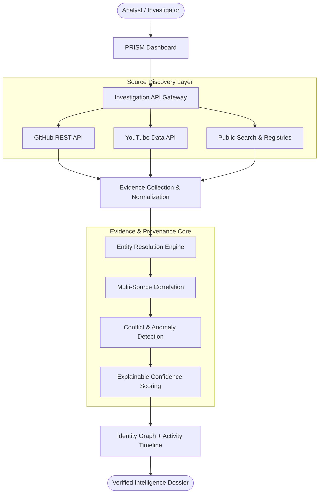
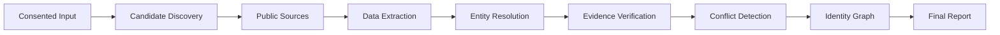

# PRISM
### Evidence-First Digital Identity Intelligence

[](https://github.com/abdulkani007/PRISM)
[](https://github.com/abdulkani007/PRISM)
[](https://github.com/abdulkani007/PRISM)

> **"Discover. Correlate. Verify. Explain."**

**PRISM** is an evidence-first digital identity intelligence and public footprint verification system engineered for **NEURAX HACKATHON 3.0 (Domain 3: AI in Cybersecurity)**. It automates the discovery, correlation, and verification of fragmented public information (profiles, handles, technical contributions, and career affiliations) starting from an authorized reference image and limited seed context. By operating strictly within consented, open-web boundaries, PRISM eliminates manual investigation overhead while enforcing zero-trust auditability across every finding.

---

## 🎯 Problem

Public digital presence is distributed across GitHub, YouTube, conferences, technical publications, and portfolio sites. Connecting these fragmented records manually is slow, error-prone, and susceptible to false associations caused by common names or namespace collisions. Investigators lack an automated system that distinguishes raw claims from corroborated evidence and surfaces conflicting affiliations.

---

## 💡 Our Solution

PRISM replaces blind web scraping with a structured four-stage intelligence loop:

* **DISCOVER**: Queries authorized, open platforms (GitHub REST API, YouTube Data API, public registries) using consented seed context.
* **CORRELATE**: Normalizes disparate handles, names, and bio metadata into unified candidate identity clusters.
* **VERIFY**: Cross-references claims across independent sources to identify multi-source corroboration or institutional conflicts.
* **EXPLAIN**: Generates a provenance-tracked intelligence dossier backed by an interactive relationship graph and activity timeline.

---

## ⭐ What Makes PRISM Different?

* **Evidence Attached to Every Finding**: No affiliation or role is accepted without an immutable source URL, raw response excerpt, and timestamp.
* **Cross-Platform Correlation**: Triangulates identities through mutual backlinks, repository commit signatures, and public biographical references.
* **Source Provenance**: Maintains strict data ancestry, separating unverified user claims from independently retrieved public evidence.
* **Conflict Detection**: Explicitly detects and alerts analysts when sources provide mutually exclusive information instead of silently overwriting records.
* **Identity Relationship Graph**: Maps people, handles, organizations, and repositories into an interactive graph rather than a flat list of links.
* **Explainable Confidence**: Replaces opaque AI percentages with an Explainable Evidence Confidence Score (EECS) based on verifiable corroborating signals.

---

## 🏗️ Architecture



---

## 🔄 Investigation Flow



---

## 🔎 Evidence Model

PRISM treats every finding as an evidence-backed assertion with an explicit verification status:

### Example 1: Corroborated Finding
```text
Finding:  "Associated with ABC University as Researcher"
Evidence:
  • Source A (GitHub Profile)  ──► Affiliation: "ABC University"
  • Source B (Conference Page) ──► Speaker: "Alex K. (ABC University)"
Status:   CORROBORATED (Confidence: High)
```

### Example 2: Conflict Detected
```text
Finding:  "Current Primary Employer"
Conflict:
  • Source A (GitHub Bio)   ──► "Staff Engineer @ Apex Defense"
  • Source B (YouTube Talk) ──► "Head of Security @ CyberShield Labs"
Status:   CONFLICT DETECTED ──► Requires Analyst Review (Confidence: Downgraded)
```

---

## 🧠 AI Layer

PRISM utilizes high-speed AI inference (powered by **Groq LPU** running open-weight LLMs like Llama-3) as a **deterministic semantic reasoning layer**:

* **Entity Extraction**: Parses free-form bios and conference abstracts into normalized entities (organizations, roles, tools).
* **Semantic Comparison**: Identifies matching projects across different handle naming conventions.
* **Conflict Deduction**: Flags temporal and organizational discrepancies across extracted claims.

> [!IMPORTANT]
> **Source Evidence is Always Primary**: The LLM is never treated as a source of truth. Every output assertion must cite a verifiable source URI and public evidence hash.

---

## 🛡️ Privacy & Responsible Use

* **Strict Consent Boundary**: Investigations require an authorized verification scope and consented reference data.
* **Public & Authorized Sources Only**: Queries only legitimate, publicly indexed, or authenticated platform APIs.
* **Zero Intrusion**: No access to private accounts, direct messages, or non-public data.
* **No Credential Abuse**: Zero use of password spraying, credential stuffing, or access-control bypassing.
* **No Leaked Datasets**: Dark-web dumps and breach databases are strictly prohibited.
* **Claims vs. Evidence**: User-provided inputs are categorized as unverified claims until proven by independent third-party evidence.
* **Uncertainty Surfacing**: Low-confidence associations and conflicting records are prominently highlighted for human review.

---

## 🧰 Tech Stack

| Component | Technology | Role / Purpose | Status |
|---|---|---|---|
| **Frontend** | React 18 + Vite | Analyst intelligence dashboard & UI | Checkpoint 1 Specification |
| **Language** | TypeScript / Python 3.10+ | Type-safe contracts & intelligence processing | Checkpoint 1 Specification |
| **Backend API** | FastAPI (Async) | REST gateway & concurrent source orchestration | Checkpoint 1 Specification |
| **AI Inference** | Groq LPU (Llama-3) | Rapid semantic extraction & conflict deduction | Planned Integration |
| **Source APIs** | GitHub REST / YouTube Data | Authenticated public profile & talk discovery | Planned Integration |
| **Graph Modeling**| Cytoscape.js / NetworkX | Dynamic identity graph & centrality mapping | Planned Integration |
| **Validation** | Pydantic v2 | Strict schema validation & input sanitization | Checkpoint 1 Specification |

---

## 📂 Project Structure

```text
PRISM/
├── README.md              # Presentation-ready technical documentation
├── .gitignore             # Security-first rules (secrets, venv, caches)
├── .env.example           # Environment template (redacted API keys)
├── backend/               # FastAPI backend service (Planned Checkpoint 2)
│   ├── app/
│   │   ├── main.py        # API gateway router & middleware
│   │   ├── services/      # GitHub, YouTube & Groq API workers
│   │   ├── models/        # Pydantic schemas (Person, Finding, Evidence)
│   │   └── core/          # Provenance, conflict engine & security
│   └── requirements.txt   # Python dependency manifest
└── frontend/              # React + Vite console (Planned Checkpoint 2)
    ├── src/
    │   ├── components/    # Graph viewer, timeline & evidence matrix
    │   └── App.tsx        # Dashboard shell & query workflow
    └── package.json       # Frontend package configuration
```

---

## 🚀 Quickstart & Setup

### 1. Clone & Configure
```bash
git clone https://github.com/abdulkani007/PRISM.git
cd PRISM
cp .env.example .env
```

### 2. Configure Credentials (In `.env`)
```bash
# Core API Keys (Never commit to Git)
GROQ_API_KEY=gsk_your_groq_key_here
GITHUB_TOKEN=ghp_your_github_token_here
YOUTUBE_API_KEY=AIzaSy_your_youtube_key_here
```

### 3. Run Backend & Frontend (Upon Checkpoint 2 Deployment)
```bash
# Backend
cd backend && python -m venv venv && source venv/bin/activate
pip install -r requirements.txt
uvicorn app.main:app --reload

# Frontend
cd ../frontend && npm install && npm run dev
```

---

## 👥 Team & License

* **Hackathon**: NEURAX HACKATHON 3.0 — AI in Cybersecurity
* **Team**: [abdulkani007](https://github.com/abdulkani007) & Team
* **License**: To Be Determined (Evaluation & Research use)

```
PRISM: Discover. Correlate. Verify. Explain.
```
