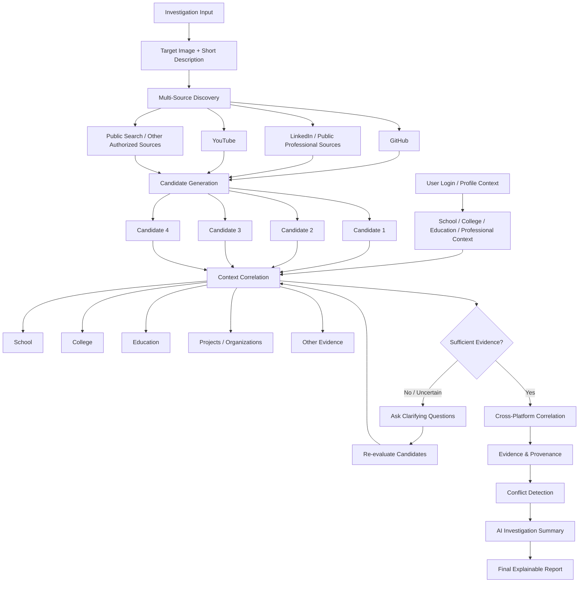

# PRISM
### Evidence-First Digital Identity Intelligence

[](https://github.com/abdulkani007/PRISM)
[](https://github.com/abdulkani007/PRISM)
[](https://github.com/abdulkani007/PRISM)

> **"Discover. Correlate. Verify. Explain."**

PRISM is a consent-based digital identity intelligence platform that discovers, correlates, and verifies publicly available information across multiple authorized sources.

Instead of returning a single guessed identity, PRISM generates multiple candidates, compares contextual signals, correlates cross-platform evidence, detects conflicts, and presents an explainable investigation summary.

---

## 1. Problem

Digital identity information is fragmented across platforms. A person's education, projects, professional history, social profiles, and public activities may exist across different sources.

The challenge is not simply finding profiles — it is determining whether those profiles and pieces of information actually refer to the same person.

---

## 2. Our Solution

```
CONSENTED CONTEXT
        +
IMAGE + DESCRIPTION
        ↓
     DISCOVER
        ↓
GENERATE CANDIDATES
        ↓
    CORRELATE
        ↓
     VERIFY
        ↓
     EXPLAIN
```

PRISM combines user-provided context with an investigation image and short description to discover multiple possible candidates from approved public sources.

It then correlates education, organizations, projects, usernames, profiles, and other public signals to identify relationships and inconsistencies.

---

## 3. Core Workflow

The following architecture models the complete investigation and correlation pipeline:



---

## 4. What Makes PRISM Different?

* **Multi-Candidate Generation**: Rather than jumping to a single speculative match, PRISM surfaces candidate profiles and evaluates them side by side.
* **Contextual Signal Triangulation**: Correlates educational history, corporate affiliations, repository commit histories, and public conference talks.
* **Interactive Disambiguation**: When public evidence is sparse or ambiguous, PRISM dynamically generates clarifying questions for the investigator before finalizing conclusions.
* **Conflict & Anomaly Detection**: Explicitly identifies and flags contradictions (e.g., mutually exclusive locations or overlapping employment claims).
* **Data Provenance**: Every material finding traces directly to an authenticated source URI and raw evidence hash.
* **Explainable Confidence**: Replaces opaque AI percentages with an Explainable Evidence Confidence Score (EECS) based on verified corroborating signals.

---

## 5. Evidence & Conflict Model

PRISM separates unverified claims from independently verified facts:

### Case A: Corroborated Finding
```text
Finding:  "Affiliated with ABC University as AI Researcher"
Evidence:
  • Source 1 (GitHub Bio)      ──► "Researcher @ ABC University"
  • Source 2 (Conference Talk) ──► Speaker: "Alex K. (ABC University)"
Status:   CORROBORATED (Confidence: High)
```

### Case B: Conflict Detected
```text
Finding:  "Current Primary Affiliation"
Conflict:
  • Source 1 (GitHub Profile)  ──► "Staff Engineer @ Nexus Defense"
  • Source 2 (YouTube Keynote) ──► "Head of Research @ CyberShield Labs"
Status:   CONFLICT DETECTED ──► Requires Investigator Review
```

---

## 6. AI & Reasoning Layer

PRISM deploys ultra-fast AI inference (**Groq LPU** running open-weight models like Llama-3) as an auditable reasoning and structuring engine:

* **Information Extraction**: Normalizes semi-structured bios, talk transcripts, and publication records into unified entity schemas.
* **Candidate Disambiguation**: Compares technical vocabulary, project overlaps, and co-authors across candidates.
* **Conflict Deduction**: Flags temporal overlaps and contradictory affiliations.

> [!IMPORTANT]
> **Source Evidence is Ground Truth**: The AI layer interprets and structures facts but never invents them. Every output assertion is explicitly anchored to verifiable public data.

---

## 7. Privacy, Consent & Ethical Boundaries

PRISM is designed strictly for authorized, defensive, and compliance-driven identity intelligence:

* **Strict Consent Scope**: Investigations operate solely on organizer-authorized reference images and agreed evaluation contexts.
* **Public & Authorized Sources Only**: Queries only legitimate, publicly indexed, or authenticated platform APIs.
* **Zero Private Intrusion**: No access to private profiles, direct messages, or non-public databases.
* **No Credential Abuse**: Zero use of password spraying, credential harvesting, or access-control bypasses.
* **No Leaked Datasets**: Dark-web dumps and breach databases are strictly prohibited.
* **Claims vs. Evidence**: Seed inputs are cataloged as claims until corroborated by independent third-party evidence.

---

## 8. Tech Stack & Implementation Status

| Component | Technology | Role | Status |
|---|---|---|---|
| **Frontend** | React 18 + Vite + TypeScript | Analyst intelligence dashboard & triage UI | Checkpoint 1 Specification |
| **Backend** | FastAPI (Python 3.10+) | High-concurrency async orchestration gateway | Checkpoint 1 Specification |
| **AI Inference** | Groq LPU (Llama-3) | Rapid semantic extraction & conflict deduction | Planned Integration |
| **Source APIs** | GitHub REST / YouTube Data | Authenticated public profile & presentation discovery | Planned Integration |
| **Graph Modeling** | NetworkX / Cytoscape.js | Identity relationship graph & centrality mapping | Planned Integration |
| **Validation** | Pydantic v2 | Strict schema enforcement & input sanitization | Checkpoint 1 Specification |

---

## 9. Project Structure

```text
PRISM/
├── README.md              # Presentation-ready technical documentation
├── .gitignore             # Security-first exclusions (secrets, caches, venv)
├── .env.example           # Environment configuration template
├── backend/               # FastAPI backend service (Checkpoint 2)
│   ├── app/
│   │   ├── main.py        # Gateway router & middleware
│   │   ├── services/      # GitHub, YouTube & Groq workers
│   │   └── models/        # Pydantic schemas (Person, Finding, Evidence)
│   └── requirements.txt   # Python dependencies
└── frontend/              # React + Vite console (Checkpoint 2)
    ├── src/
    │   ├── components/    # Graph visualizer, timeline & evidence matrix
    │   └── App.tsx        # Dashboard shell
    └── package.json       # Frontend dependencies
```

---

## 10. Quickstart & Setup

### 1. Clone & Configure
```bash
git clone https://github.com/abdulkani007/PRISM.git
cd PRISM
cp .env.example .env
```

### 2. Configure Credentials (In `.env`)
```bash
# Core API Keys (Keep private; never commit to Git)
GROQ_API_KEY=gsk_your_groq_key_here
GITHUB_TOKEN=ghp_your_github_token_here
YOUTUBE_API_KEY=AIzaSy_your_youtube_key_here
```

### 3. Run Services (Checkpoint 2 Deployment)
```bash
# Backend
cd backend && python -m venv venv && source venv/bin/activate
pip install -r requirements.txt
uvicorn app.main:app --reload

# Frontend
cd ../frontend && npm install && npm run dev
```

---

## 11. Hackathon Context & Team

* **Hackathon**: NEURAX HACKATHON 3.0 — AI in Cybersecurity (Domain 3)
* **Milestone**: Checkpoint 1 — Architecture, Problem Understanding & Approach
* **Team**: [abdulkani007](https://github.com/abdulkani007) & Team
* **License**: To Be Determined (Evaluation & Research use)

```
PRISM: Discover. Correlate. Verify. Explain.
```
